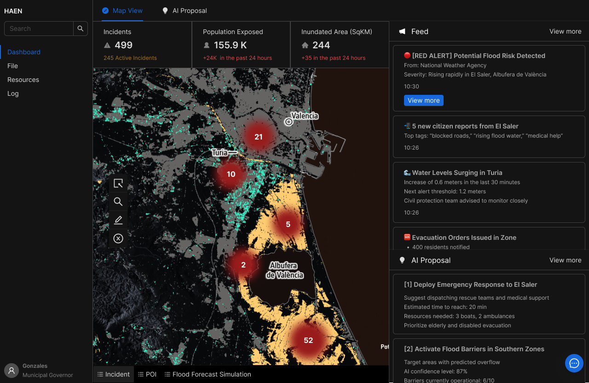
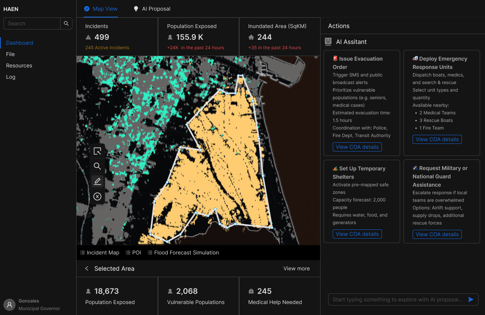
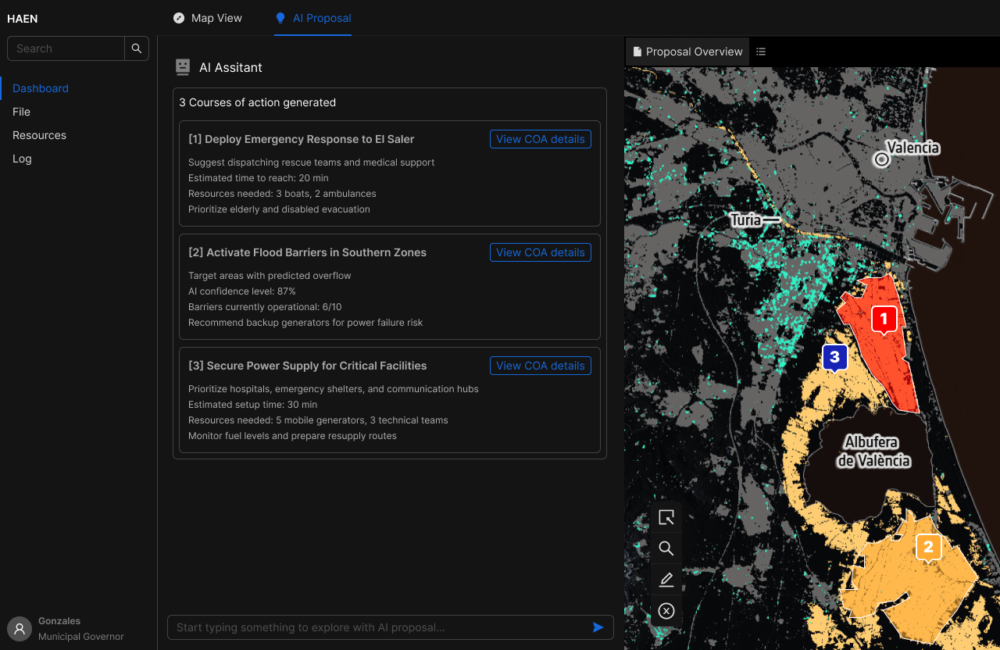
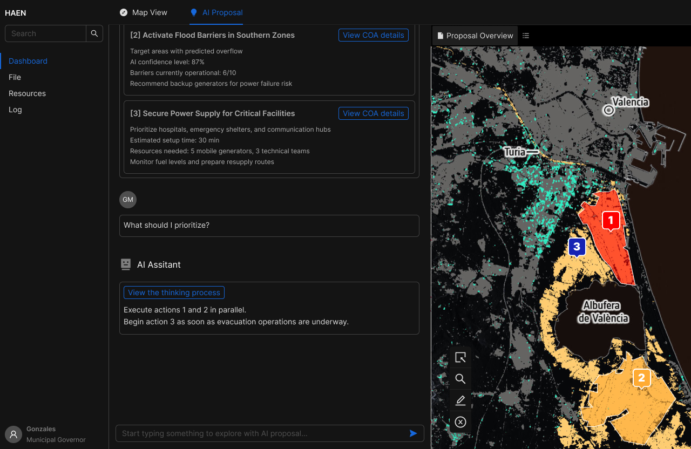
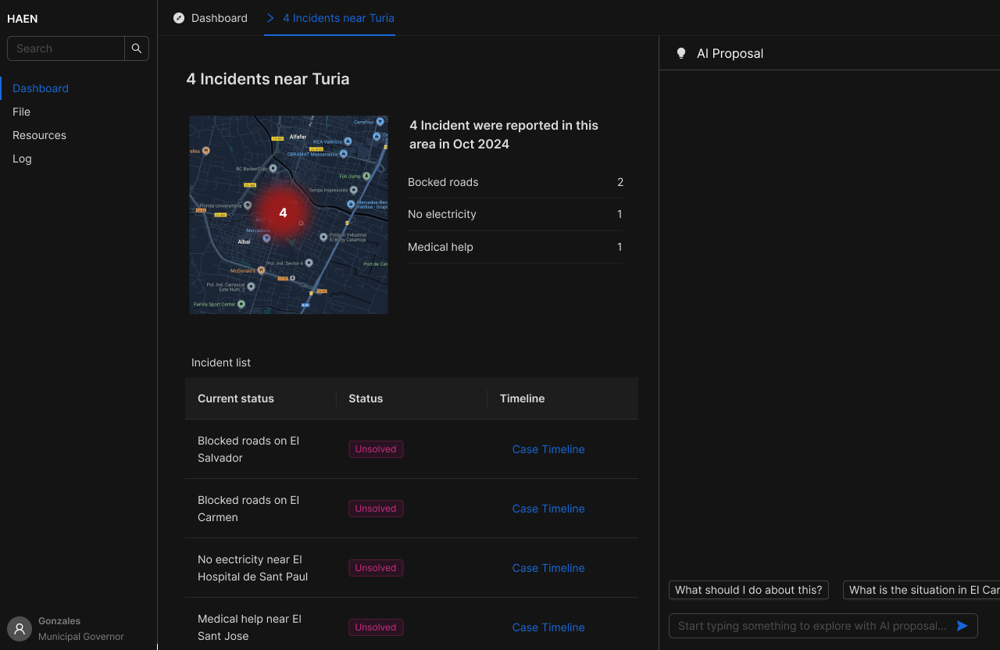
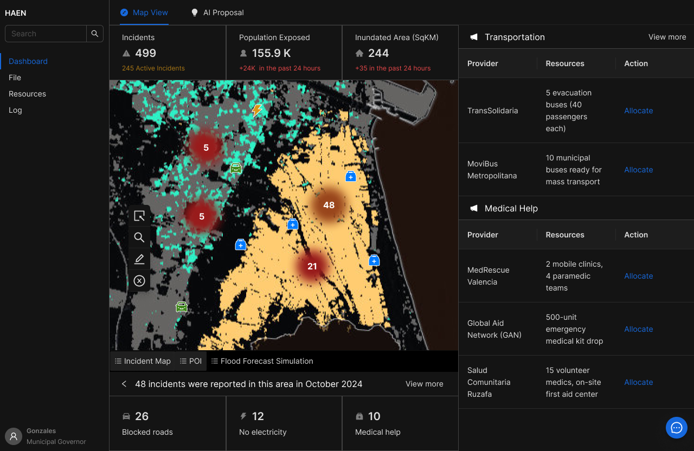
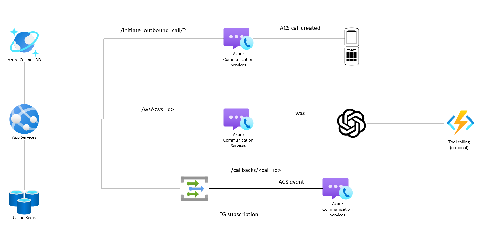
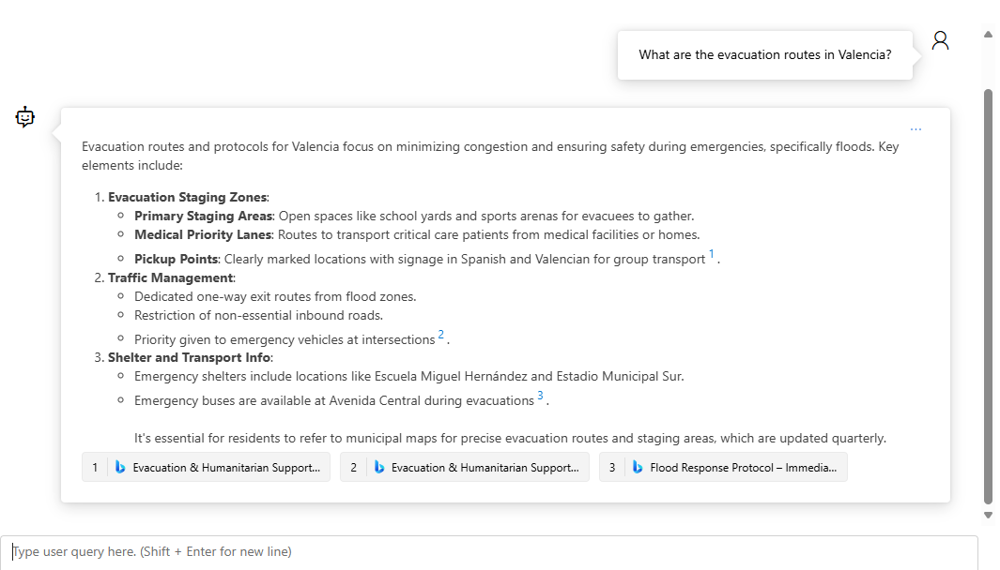

# HAEN - AI Agent for City-Scale Disaster Response & Decision-Making 
> MSFT AI Agents Hackathon April 2025

This solution takes the use case of the floods that happened in Valencia, Spain, during 2025, where multiple people lost their lives and the whole region ended up devastated. These results could've been significantly mitigate with proper and timely action, but a series of errors, miscommunication and late action on the authorities end made everything worse. 

Rather than seeking blame, this solution targets the process, seeking to improve efficiency and making these rare but impactful scenarios easy to navigate and make decisions upon by leveraging AI to surface insights, digest complex legislation and drive semi-automated actions. 

While we take the example of Valencia, this applies to any other region as catastrophes (floods, fires, earthquakes, tsunamis, heat waves, storms, etc.) become a more common event, accelerated by climate change.

## Problem Statement and Solution Video:
[WATCH THE VIDEO - HAEN: AI Agent for City-Scale Disaster Response & Decision-Making ](https://www.youtube.com/watch?v=bC1P_mANeuU&feature=youtu.be)

## User Experience
As seen in the video above, HAEN works as a platform to gather data, surface it as insights, and provide an action-driven solutionization for the public sector agents involved in emergency management and disaster recovery due to natural catastrophes. This last one is key, because having an action driven approach accelerates decision making and implementation in a moment where every minute counts, potentially saving lives and reducing damages.

The proposal UI/UX is built on Figma with the goal of surfacing the power of the AI Agents described below in a human-centric manner, taking the power of GenAI to the next step.

1. The analysis page gathers data from different sources, like alerts, smart city sensors, and citizen emergencies. Authorities can easily use this page to dive deep into the information to generate insights. Nonetheless, since we know that time is crucial here, the Authority Action AI Agent will suggest some key actions based on the context, timeline of events and it's knowledge on the official Protocols, approaching this as a multi-agent system. Thus, authorities or relevant public sector agents can get to action instantly, also able to dive deeper by leveraging the conversational capabilities to inspect the reasoning further.

2. The alerts page contains as well the map, showing the situation and offering key visual guidance to trigger the Alerts AI Agent, which leverages citizen data and the AI Communications API to send SMS to the general population in a timely manner, but also to initiate real-time phone calls for vulnerable citizens (elderly, disabled, foreign population, or anyone that requires additional support), where they can hold a conversation in their prefered language (Valencia is a multilingual region with high levels immigration, but this is applicable to many other parts of the world), ask clarifying questions, and request help via the RaiseAlert tool, bringing that insight back to HAEN.

3. As data keeps being gathered during the incident, the human user can decide how to act in a straightforward manner, with the different agents surfacing data of the resources available (medical, military, NGO, and similar resources)

!

## Solution Description

### 1. Alerts AI Agent:
Uses Azure AI Agent service to leverage the [AI Communications API](/agents/acs-realtime-ai-api-coms/README.md) via an OpenAPI action tool on Agent Service, for sending SMS and triggering outbound AI phone calls to vulnerable citizens, and it has also access to the Citizen DB, containing the citizen data like names, and vulnerability flags, allowing to leverage that data during the calls via HTTP payload.

**AI Communications API:**
> NOTE: We used C# .NET 8 for this to ensure speed, easy session management and threat safety.

- Descrption: Handles communication to citizens, with outbound static SMSs for the general population and outbound AI phone calls for the vulnerable citizens, allowing the handle questions, multilingual conversations, and capturing emergencies via function calling with `RaiseEmergencyAlert`, which sends back an alert object into the data layer of HAEN. 
- Services:
    - Azure Communication Services (ACS): SMS service and CallAutomation (with MediaStreaming enabled)
    - GPT-4o-realtime-preview: Real-time AI model
    - Azure App Service: hosting the API
    - Redis Cache: session management to scale out to 1000s of calls
    - Event Grid: handling the event asynchrounously
- Logic:
    1. The call gets started by sending a payload with an array of phone numbers and the alert message to `/api/initiateOutboundCall`
    2. ACS sends back the event of CallCreated and ParticipantAdded when the citizen picks up the phone, and creates activates the web socket
    3. The conversation flows bidirectionally between GPT-40-realtime-preview and the citizen till either end hangs up
    

### 2. Authority Action AI Agent
Uses a multi-agent system via Semantic Kernel Process Framework to coordinate the steps to (i) understand the current context via Data Analytics Agent, (ii) explore the protocol for the next potential actions via the Protocol RAG Agent, and (iii) offer the option to the authority to trigger some standard actions via the Actions API Agent. Additionally, the News & Social Media Agent, gathers updates and makes them visible to the Data Analytics Agent for reasoning over the latest information. All four sub-agents are built using Azure AI Agent Service:
1. [Data Analytics Agent](./agents/data-analytics-agent/readme.md): Explores the data layer underneath HAEN to gather insights and help understanding the situation, using Azure AI Agent Service and Cosmos DB on Python. We added an Audits & Logs Agent that leverages that same data layer (Cosmos DB) to track key changes and updates for monitoring and maintaining a timeline for compliance and to keep an order to help the Authority agent make better decisions.
2. [Potocol RAG Agent](./agents/protocol-rag-agent/README.md): Using AI Agent Service and Azure Search Service on Python, performs a RAG pattern over the complex protocol data, allowing the digest and extract key data from the official guidelines efficiently. The index has been built manually on the portal as described on the README file, and approached it as Hybrid Semantic Search to ensure maximum relevancy and accuracy of results.
3. Actions API Agent (proposed): Leverages an fictional internal API in the government to perform standard quick actions via AI Agent Service's an OpenAPI action tool upon confirmation from the human in the loop.
4. [News & Social Media Agent](./agents/grounded-bing-agent/readme.md): This agent navigates news sites and social media to gather third party data that, if meaningful, can be added to the HAEN's data layer (Cosmos DB) for the Data Analytics Agent to pick up as insights. It uses AI Agent Service with Bing as the knowledge tool on Python.

> NOTE: Semantic Kernel Process Framework is in preview and human in the loop features are still being implemented with very limited options at the moment. Therefore, while we do mention it and have comments in the code, this is not currently implemented.

### 3. Copilot Studio Protocol RAG
The users will need access to information wherever they are, and one of the biggest bottlenecks the authorities experienced during the floods in Valencia was navigating the Protocol data. Since the Index has already been created, this is a great use case to leverage Copilot Studio to make the index digestible wherever users are: one an email sharing insights, on a Teams call or chat, or on their desktop with M365 Copilot.

> DISCLAIMER: Our Copilot Studio internal policies prevented us from connecting to any data source, so we're showing the AI Agents Playground in the screenshot, but the logic is the same.
